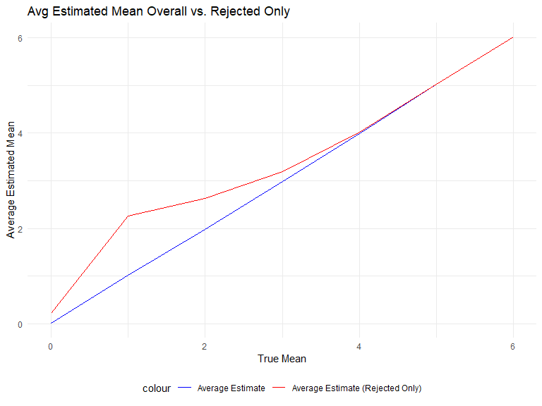

Homework 5
================
Andy Turner
2023-11-08

``` r
library(tidyverse)
```

    ## ── Attaching core tidyverse packages ──────────────────────── tidyverse 2.0.0 ──
    ## ✔ dplyr     1.1.2     ✔ readr     2.1.4
    ## ✔ forcats   1.0.0     ✔ stringr   1.5.0
    ## ✔ ggplot2   3.4.2     ✔ tibble    3.2.1
    ## ✔ lubridate 1.9.2     ✔ tidyr     1.3.0
    ## ✔ purrr     1.0.1     
    ## ── Conflicts ────────────────────────────────────────── tidyverse_conflicts() ──
    ## ✖ dplyr::filter() masks stats::filter()
    ## ✖ dplyr::lag()    masks stats::lag()
    ## ℹ Use the conflicted package (<http://conflicted.r-lib.org/>) to force all conflicts to become errors

``` r
library(rvest)
```

    ## 
    ## Attaching package: 'rvest'
    ## 
    ## The following object is masked from 'package:readr':
    ## 
    ##     guess_encoding

``` r
library(purrr)
library(broom)

knitr::opts_chunk$set(
    echo = TRUE,
    warning = FALSE,
    fig.width = 8, 
  fig.height = 6,
  out.width = "90%"
)

theme_set(theme_minimal() + theme(legend.position = "bottom"))

options(
  ggplot2.continuous.colour = "viridis",
  ggplot2.continuous.fill = "viridis"
)
```

## Problem 1

Reading in the homicide datafile.

**Description of raw data**

The data includes information on `nrow(homicide)` criminal homicides
over the past decade in 50 of the largest American cities. The data
included the location of the killing, whether an arrest was made and, in
most cases, basic demographic information about each victim. Overall
there are `ncol(homicide)` variables in the dataset.

``` r
homicide = 
  homicide |> 
  mutate(city_state = paste(city, state, sep = ", ")
)

baltimore_df=
  homicide |> 
  filter(city == "Baltimore") |> 
  mutate(
    resolved= as.numeric(disposition == "Closed by arrest"),
    victim_age= as.numeric(victim_age)
  ) |> 
  select(resolved, victim_age, victim_race, victim_sex)
```

Logistic Regression

Look at the results

# Problem 2

**Creating initial dateframe with `list.files`**

``` r
take2 <- list.files("data1/", pattern = "\\.csv$", full.names = FALSE) |> 
  as.data.frame() |> 
  setNames("file_path")
```

I used the `list.files` function to pull in all my csv files from my
“data1” folder. I decided to only keep the file name and not the full
path. Moreover, I used `as.data.frame()` to convert the result into a
dataframe with `setNames("file_path")` specifying my column name.

**Using map function**

``` r
take2 <- take2 |> 
  mutate(weeks = map(file_path, ~ read_csv(file.path("data1/", .x))))
```

    ## Rows: 1 Columns: 8
    ## ── Column specification ────────────────────────────────────────────────────────
    ## Delimiter: ","
    ## dbl (8): week_1, week_2, week_3, week_4, week_5, week_6, week_7, week_8
    ## 
    ## ℹ Use `spec()` to retrieve the full column specification for this data.
    ## ℹ Specify the column types or set `show_col_types = FALSE` to quiet this message.
    ## Rows: 1 Columns: 8
    ## ── Column specification ────────────────────────────────────────────────────────
    ## Delimiter: ","
    ## dbl (8): week_1, week_2, week_3, week_4, week_5, week_6, week_7, week_8
    ## 
    ## ℹ Use `spec()` to retrieve the full column specification for this data.
    ## ℹ Specify the column types or set `show_col_types = FALSE` to quiet this message.
    ## Rows: 1 Columns: 8
    ## ── Column specification ────────────────────────────────────────────────────────
    ## Delimiter: ","
    ## dbl (8): week_1, week_2, week_3, week_4, week_5, week_6, week_7, week_8
    ## 
    ## ℹ Use `spec()` to retrieve the full column specification for this data.
    ## ℹ Specify the column types or set `show_col_types = FALSE` to quiet this message.
    ## Rows: 1 Columns: 8
    ## ── Column specification ────────────────────────────────────────────────────────
    ## Delimiter: ","
    ## dbl (8): week_1, week_2, week_3, week_4, week_5, week_6, week_7, week_8
    ## 
    ## ℹ Use `spec()` to retrieve the full column specification for this data.
    ## ℹ Specify the column types or set `show_col_types = FALSE` to quiet this message.
    ## Rows: 1 Columns: 8
    ## ── Column specification ────────────────────────────────────────────────────────
    ## Delimiter: ","
    ## dbl (8): week_1, week_2, week_3, week_4, week_5, week_6, week_7, week_8
    ## 
    ## ℹ Use `spec()` to retrieve the full column specification for this data.
    ## ℹ Specify the column types or set `show_col_types = FALSE` to quiet this message.
    ## Rows: 1 Columns: 8
    ## ── Column specification ────────────────────────────────────────────────────────
    ## Delimiter: ","
    ## dbl (8): week_1, week_2, week_3, week_4, week_5, week_6, week_7, week_8
    ## 
    ## ℹ Use `spec()` to retrieve the full column specification for this data.
    ## ℹ Specify the column types or set `show_col_types = FALSE` to quiet this message.
    ## Rows: 1 Columns: 8
    ## ── Column specification ────────────────────────────────────────────────────────
    ## Delimiter: ","
    ## dbl (8): week_1, week_2, week_3, week_4, week_5, week_6, week_7, week_8
    ## 
    ## ℹ Use `spec()` to retrieve the full column specification for this data.
    ## ℹ Specify the column types or set `show_col_types = FALSE` to quiet this message.
    ## Rows: 1 Columns: 8
    ## ── Column specification ────────────────────────────────────────────────────────
    ## Delimiter: ","
    ## dbl (8): week_1, week_2, week_3, week_4, week_5, week_6, week_7, week_8
    ## 
    ## ℹ Use `spec()` to retrieve the full column specification for this data.
    ## ℹ Specify the column types or set `show_col_types = FALSE` to quiet this message.
    ## Rows: 1 Columns: 8
    ## ── Column specification ────────────────────────────────────────────────────────
    ## Delimiter: ","
    ## dbl (8): week_1, week_2, week_3, week_4, week_5, week_6, week_7, week_8
    ## 
    ## ℹ Use `spec()` to retrieve the full column specification for this data.
    ## ℹ Specify the column types or set `show_col_types = FALSE` to quiet this message.
    ## Rows: 1 Columns: 8
    ## ── Column specification ────────────────────────────────────────────────────────
    ## Delimiter: ","
    ## dbl (8): week_1, week_2, week_3, week_4, week_5, week_6, week_7, week_8
    ## 
    ## ℹ Use `spec()` to retrieve the full column specification for this data.
    ## ℹ Specify the column types or set `show_col_types = FALSE` to quiet this message.
    ## Rows: 1 Columns: 8
    ## ── Column specification ────────────────────────────────────────────────────────
    ## Delimiter: ","
    ## dbl (8): week_1, week_2, week_3, week_4, week_5, week_6, week_7, week_8
    ## 
    ## ℹ Use `spec()` to retrieve the full column specification for this data.
    ## ℹ Specify the column types or set `show_col_types = FALSE` to quiet this message.
    ## Rows: 1 Columns: 8
    ## ── Column specification ────────────────────────────────────────────────────────
    ## Delimiter: ","
    ## dbl (8): week_1, week_2, week_3, week_4, week_5, week_6, week_7, week_8
    ## 
    ## ℹ Use `spec()` to retrieve the full column specification for this data.
    ## ℹ Specify the column types or set `show_col_types = FALSE` to quiet this message.
    ## Rows: 1 Columns: 8
    ## ── Column specification ────────────────────────────────────────────────────────
    ## Delimiter: ","
    ## dbl (8): week_1, week_2, week_3, week_4, week_5, week_6, week_7, week_8
    ## 
    ## ℹ Use `spec()` to retrieve the full column specification for this data.
    ## ℹ Specify the column types or set `show_col_types = FALSE` to quiet this message.
    ## Rows: 1 Columns: 8
    ## ── Column specification ────────────────────────────────────────────────────────
    ## Delimiter: ","
    ## dbl (8): week_1, week_2, week_3, week_4, week_5, week_6, week_7, week_8
    ## 
    ## ℹ Use `spec()` to retrieve the full column specification for this data.
    ## ℹ Specify the column types or set `show_col_types = FALSE` to quiet this message.
    ## Rows: 1 Columns: 8
    ## ── Column specification ────────────────────────────────────────────────────────
    ## Delimiter: ","
    ## dbl (8): week_1, week_2, week_3, week_4, week_5, week_6, week_7, week_8
    ## 
    ## ℹ Use `spec()` to retrieve the full column specification for this data.
    ## ℹ Specify the column types or set `show_col_types = FALSE` to quiet this message.
    ## Rows: 1 Columns: 8
    ## ── Column specification ────────────────────────────────────────────────────────
    ## Delimiter: ","
    ## dbl (8): week_1, week_2, week_3, week_4, week_5, week_6, week_7, week_8
    ## 
    ## ℹ Use `spec()` to retrieve the full column specification for this data.
    ## ℹ Specify the column types or set `show_col_types = FALSE` to quiet this message.
    ## Rows: 1 Columns: 8
    ## ── Column specification ────────────────────────────────────────────────────────
    ## Delimiter: ","
    ## dbl (8): week_1, week_2, week_3, week_4, week_5, week_6, week_7, week_8
    ## 
    ## ℹ Use `spec()` to retrieve the full column specification for this data.
    ## ℹ Specify the column types or set `show_col_types = FALSE` to quiet this message.
    ## Rows: 1 Columns: 8
    ## ── Column specification ────────────────────────────────────────────────────────
    ## Delimiter: ","
    ## dbl (8): week_1, week_2, week_3, week_4, week_5, week_6, week_7, week_8
    ## 
    ## ℹ Use `spec()` to retrieve the full column specification for this data.
    ## ℹ Specify the column types or set `show_col_types = FALSE` to quiet this message.
    ## Rows: 1 Columns: 8
    ## ── Column specification ────────────────────────────────────────────────────────
    ## Delimiter: ","
    ## dbl (8): week_1, week_2, week_3, week_4, week_5, week_6, week_7, week_8
    ## 
    ## ℹ Use `spec()` to retrieve the full column specification for this data.
    ## ℹ Specify the column types or set `show_col_types = FALSE` to quiet this message.
    ## Rows: 1 Columns: 8
    ## ── Column specification ────────────────────────────────────────────────────────
    ## Delimiter: ","
    ## dbl (8): week_1, week_2, week_3, week_4, week_5, week_6, week_7, week_8
    ## 
    ## ℹ Use `spec()` to retrieve the full column specification for this data.
    ## ℹ Specify the column types or set `show_col_types = FALSE` to quiet this message.

The `map` function was used in conjunction with `read_csv` to read over
all my values in the original “file_path” column and pull them into a
new variable “weeks.”

**Tidying data - pivoting longer**

``` r
take2 =
  take2 |> 
  unnest(weeks) |> 
  pivot_longer(
    cols= starts_with("Week_"),
    names_to = "week",
    values_to = "value"
  ) |> 
  separate(file_path, into =c("arm", "ID"), sep ="_", remove = FALSE) |> 
  mutate(number = sub(".csv", "", ID),
         arm= case_match(arm,
                         "con" ~ "Control",
                         "exp" ~"Experiment"))
```

To clean my data, I wanted to perform a few key steps

1.  Unnesting the weeks variable, so that it was easier to manipulate.
2.  Pivoting the data to long format to make graphing a spaghetti plot
    easier. Instead of having the weeks variable in one row, the data
    was pivoted so that “week” became a column with values week_1 to
    week_8 and their corresponding values were placed in the “value”
    column.
3.  To add Arm Names and Study ID: I used `separate` to create a new
    variable to identify which participants were in Control
    vs. Experiment arm, and their Study ID (I am assuming they were
    paired). I used the “remove = FALSE” section to retain the original
    file_path variable.
4.  Last, I just decided to rename the values within the “arm” variable
    to Control and Experiment using the `case_match()` function.

**Plotting**

``` r
take2 |> 
  ggplot(aes(x=week, y=value, group=file_path, color= arm))+ 
  geom_line()+
  labs(title= "Control vs. Experimental Arms Over 8 Weeks")
```


**Differences between groups**: Overall it appears that Experiment
participants have higher values than Control participants throughout the
8 weeks. Control participants saw there values stay the same throuhgout
the period whereas Experiment participants generally appeared to trend
upward.

# Problem 3

**Simulated Power Analysis**

``` r
set.seed(12345)

simulate_power_analysis <- function(mu_values, n = 30, sigma = 5, iterations = 5000, alpha = 0.05) {
  
ran_samp <- function(mu) {
  data <- tibble(x= rnorm(n, mu, sigma))

  t_test_result <- data |> pull(x) |> t.test()

  estimate = data |>  pull(x) |> mean()
  p_value = t_test_result |> tidy() |> pull(p.value)

  return(tibble(mu_hat= estimate, p_value = p_value))
}

  result_df <- 
    expand_grid(
      mu = mu_values,
      iter = 1:iterations
    ) |> 
    mutate(
      estimate_df = map(mu, ~ran_samp(.))
    ) |> 
    unnest(estimate_df)
  
  return(result_df)
}

power_information =
simulate_power_analysis(0:6)
```

**Summary of my function(s)** To start, I created a function `ran_samp`.
`ran_samp` first creates a tibble with a randomly drawn normal
distribution, it runs a t-test on the generated values, and extracts the
estimated mu values and the p_values associated with the t-test. I
nested `ran_samp` within a larger function named
`simulate_power_analysis.` `simulate_power_analysis` creates a dataframe
“result_df.” `expand_grid` creates a tibble with a mu column (which is
set in my `function` statement as mu_values, so whatever value set for
mu_values will be one set of values) and an iteration column spanning 1
to 5000. From there, I create an estimate_df variable which uses the map
function to trigger my `ran_samp` function to run for each value of mu
(mu=mu_values). Lastly, I unnest the estimate_df variable.

With my function(s) created, I just ran `simulate_power_analysis` with
mu_values= 0:6 and saved the results in the `power_information`
dataframe.

## Graphing Proportion of Rejected at Different True Mean Values

``` r
power_information |> 
  mutate(rejected = ifelse(p_value <0.05, "Rejected", "Not_Rejected")) |> 
  group_by(mu) |> 
  summarize(
    proportion_rejected = mean(rejected == "Rejected")
  ) |> 
  ggplot(aes(x = mu, y = proportion_rejected, fill=mu)) +
  geom_bar(stat = "identity") +
  labs(title = "Proportion of Rejected vs. Non-Rejected for Different True Mean Values",
       x = "mu",
       y = "Proportion Rejected")
```


**Process**: I first created a variable “rejected” via an `ifelse`
statement which stated that if the p_value variable was \<0.05 then
“rejected” = “Rejected”, if not “rejected” = “Not_Rejected.” From there,
I grouped my data by the true mean (mu) and created a summary table
where “proportion_rejected” = the proportion of null that were rejected
by true mean. I chose to graph the plot with a bar plot as I found this
a very readable way to display our data as each Category (mu value) only
had 1 value (Proportion Rejected)

**Association between effect size and power**: Power increases as effect
size increases. Power was lowest at true mean 0, and highest at true
mean 6.

## Graphing True Mean x Average Estimate Mean

``` r
power_information |> 
  group_by(mu) |> 
  mutate(avg_mu = mean(mu_hat)) |> 
  filter(p_value <0.05) |> 
  summarize(avg_mu_reject= mean(mu_hat), avg_mu) |> 
  ggplot()+
  geom_line(aes(x = mu, y = avg_mu, color = "blue")) +
  geom_line(aes(x = mu, y = avg_mu_reject, color = "red")) +
  labs(title = "Avg Estimated Mean Overall vs. Rejected Only ",
       x = "True Mean",
       y = "Average Estimated Mean")+
  scale_color_manual(values = c("blue" = "blue", "red" = "red"),
                     labels = c("Average Estimate", "Average Estimate (Rejected Only)"))
```

    ## `summarise()` has grouped output by 'mu'. You can override using the `.groups`
    ## argument.



``` r
#Is the sample average of μ^
 #across tests for which the null is rejected approximately equal to the true value of μ
#? Why or why not?
```
